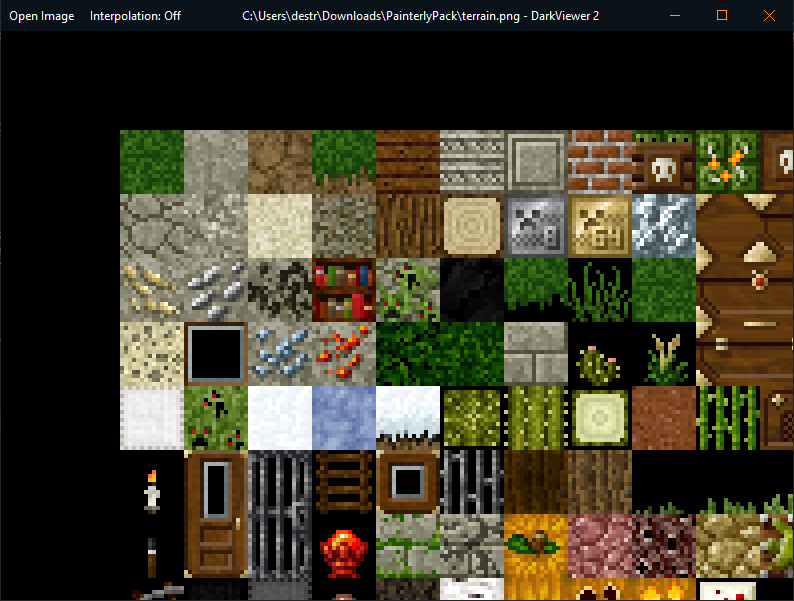
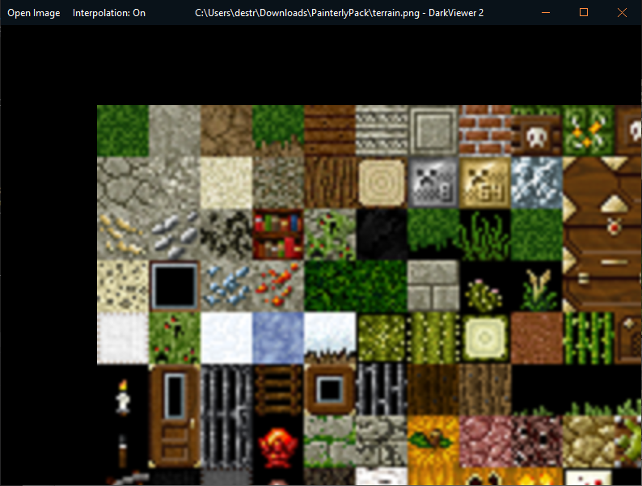

# DarkViewer 2

## A GDI image viewer with toggleable interpolation.
### Interpolation off:

### Interpolation on:

## New features over DarkViewer 1:
- Custom titlebar
- Left and right arrow keys change image
- Onscreen left and right buttons only appear when mouse is near
- Open Image file dialog button

## Build:
- Open solution in Visual Studio 2019
- Select Debug or Release x64
- Build / Run

## Download:
- Download the latest binary release from the releases page